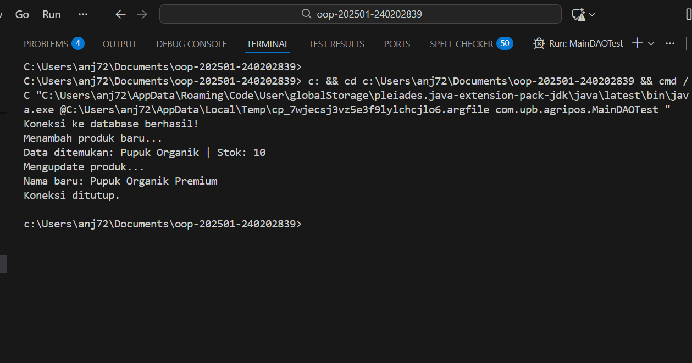

# Laporan Praktikum Minggu 1 (sesuaikan minggu ke berapa?)
Topik: Data Access Object (DAO) dan CRUD Database dengan JDBC

## Identitas
- Nama  : M. Khamdan A
- NIM   : 240202839
- Kelas : 3ikra

---

## Tujuan
Menghubungkan aplikasi Java dengan basis data PostgreSQL menggunakan JDBC.

Mengimplementasikan pola desain Data Access Object (DAO) untuk memisahkan logika akses data.

Melakukan operasi CRUD (Create, Read, Update, Delete) pada tabel produk di database agripos.

Mengintegrasikan driver JDBC ke dalam proyek OOP.

---

## Dasar Teori
DAO (Data Access Object): Pola desain yang memisahkan logika bisnis dengan logika penyimpanan data agar kode lebih modular.

JDBC (Java Database Connectivity): API standar Java untuk berinteraksi dengan berbagai jenis database relasional.

PreparedStatement: Objek dalam JDBC yang digunakan untuk mengeksekusi query SQL yang terparameter agar lebih aman dari SQL Injection.

CRUD: Operasi dasar pada database yang meliputi Create (Insert), Read (Select), Update, dan Delete.

---

## Langkah Praktikum
Setup Database: Membuat database agripos dan tabel products di PostgreSQL.

Konfigurasi Driver: Menambahkan library pendukung (driver) JDBC PostgreSQL ke proyek.

Pembuatan Model: Membuat class Product sebagai representasi data.

Implementasi DAO: Membuat interface ProductDAO dan kelas implementasinya (ProductDAOImpl) menggunakan JDBC.

Testing: Menjalankan MainDAOTest untuk menguji koneksi dan fungsi CRUD.

Commit: Melakukan push ke GitHub dengan pesan week11-dao-database.

---

## Kode Program
(Tuliskan kode utama yang dibuat, contoh:  

```java
@Override
public void insert(Product p) throws Exception {
    String sql = "INSERT INTO products(code, name, price, stock) VALUES (?, ?, ?, ?)";
    try (PreparedStatement ps = connection.prepareStatement(sql)) {
        ps.setString(1, p.getCode());
        ps.setString(2, p.getName());
        ps.setDouble(3, p.getPrice());
        ps.setInt(4, p.getStock());
        ps.executeUpdate();
    }
}
```

```java
String url = "jdbc:postgresql://localhost:5432/agripos";
String user = "postgres";
String password = "your_password"; 

try {
    Connection conn = DriverManager.getConnection(url, user, password);
    ProductDAOImpl dao = new ProductDAOImpl(conn);
    dao.insert(new Product("P01", "Pupuk Organik", 25000, 10));
    conn.close();
} catch (Exception e) {
    e.printStackTrace();
}
```
)
---

## Hasil Eksekusi

---

## Analisis
Program berhasil menghubungkan Java ke PostgreSQL melalui Driver Manager.

Penggunaan interface ProductDAO memungkinkan fleksibilitas jika di masa depan database diganti (misal ke MySQL), karena logika bisnis tidak berubah.

Try-with-resources digunakan pada PreparedStatement untuk memastikan koneksi/stream ditutup secara otomatis setelah digunakan, mencegah kebocoran memori.

Kendala yang dihadapi biasanya adalah kesalahan URL database atau password PostgreSQL yang tidak sesuai.
---

## Kesimpulan
Dengan mengimplementasikan DAO dan JDBC, aplikasi Agri-POS kini dapat menyimpan data secara permanen ke dalam database. Hal ini membuat data tetap ada meskipun aplikasi dimatikan, berbeda dengan penggunaan Collections di memori pada minggu sebelumnya.

---

