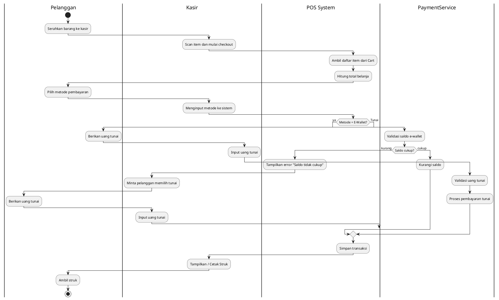
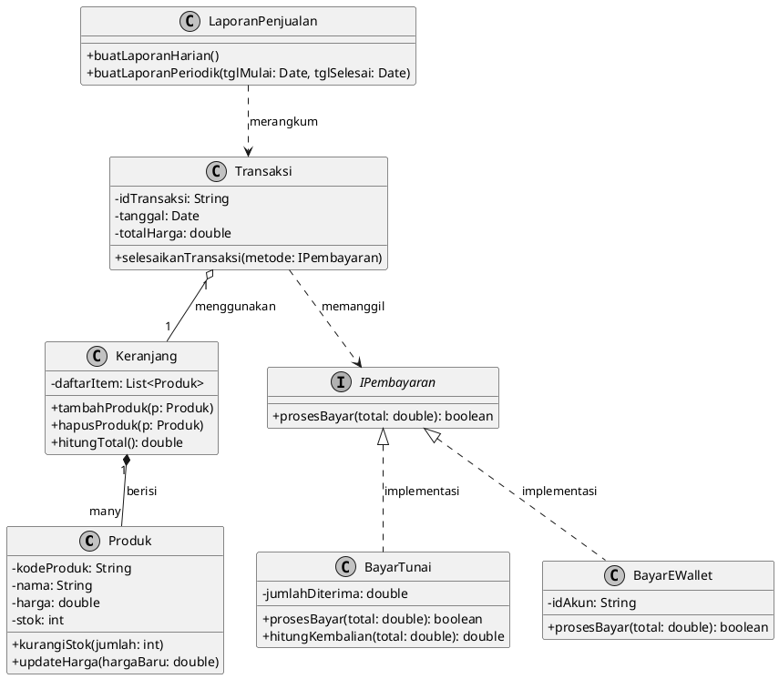
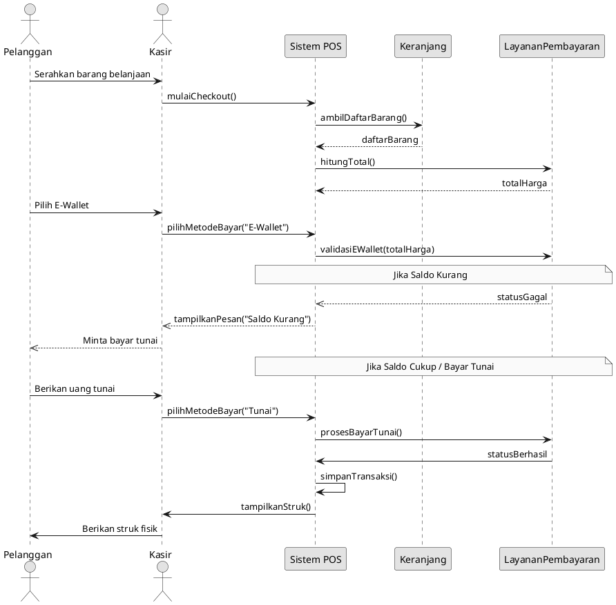
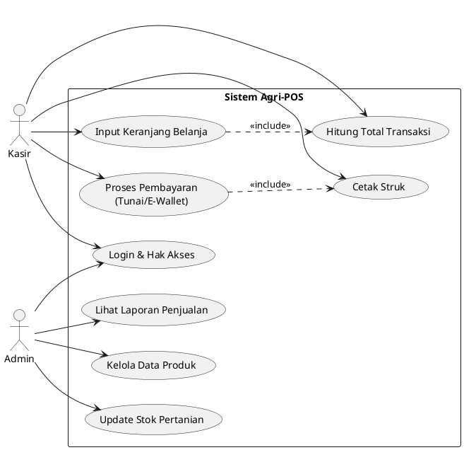

# Laporan Praktikum Minggu 6
Topik: Desain Arsitektur Sistem dengan UML dan Prinsip SOLID

## Identitas
- Nama  : M Khamdan A
- NIM   : 240202839
- Kelas : 3ikra

---

## Tujuan
Mahasiswa mampu mengidentifikasi kebutuhan sistem ke dalam diagram UML

Mahasiswa mampu menggambar UML Class Diagram dengan relasi antar class yang tepat

Mahasiswa mampu menjelaskan prinsip desain OOP (SOLID)

Mahasiswa mampu menerapkan minimal dua prinsip SOLID dalam kode program
---

## Dasar Teori
(Tuliskan ringkasan teori singkat (3–5 poin) yang mendasari praktikum.  
Contoh:  
1. Class adalah blueprint dari objek.  
2. Object adalah instansiasi dari class.  
3. Enkapsulasi digunakan untuk menyembunyikan data.)

---

## Langkah Praktikum
1. UML (Unified Modeling Language) adalah bahasa standar untuk memvisualisasikan, menspesifikasikan, membangun, dan mendokumentasikan artefak dari sistem perangkat lunak.

2. Use Case Diagram menggambarkan interaksi antara aktor (pengguna sistem) dengan fungsionalitas (use case) yang disediakan sistem.

3. Class Diagram menunjukkan struktur statis sistem dalam bentuk kelas, atribut, operasi, dan hubungan antar kelas.

4. Prinsip SOLID adalah lima prinsip desain yang bertujuan membuat perangkat lunak lebih mudah dipahami, fleksibel, dan dapat dipelihara.

5. Dependency Inversion Principle menyatakan bahwa modul tingkat tinggi tidak boleh bergantung pada modul tingkat rendah, tetapi keduanya harus bergantung pada abstraksi.

---

## Kode Program
(Tuliskan kode utama yang dibuat, contoh:  
activity.puml

class.puml

sequence.puml

usecase.puml

)
---

## Hasil Eksekusi
https://github.com/mhamdana/oop-202501-240202839/blob/main/praktikum/week6-uml-solid/doc/activitydiagram.png
https://github.com/mhamdana/oop-202501-240202839/blob/main/praktikum/week6-uml-solid/doc/classdiagram.png
https://github.com/mhamdana/oop-202501-240202839/blob/main/praktikum/week6-uml-solid/doc/squecediagram.png
https://github.com/mhamdana/oop-202501-240202839/blob/main/praktikum/week6-uml-solid/doc/usecase.png
---

## Analisis
-Bagaimana kode berjalan: Tidak ada implementasi kode pada minggu ini, hanya desain arsitektur menggunakan diagram UML (Use Case, Activity, Sequence, Class).

-Perbedaan pendekatan: Minggu lalu fokus pada implementasi kode konkret (abstraction-interface), sedangkan minggu ini fokus pada desain sistem secara makro menggunakan diagram UML sebelum coding.

-Kendala dan solusi:

Kendala menjaga konsistensi antar diagram → diselesaikan dengan tabel traceability

Kendala menerapkan SOLID dalam konsep → diselesaikan dengan desain interface IPembayaran yang menerapkan OCP dan DIP

---

## Kesimpulan
*Dengan menggunakan diagram UML (Use Case, Activity, Sequence, dan Class Diagram), desain arsitektur sistem Agri-POS menjadi lebih terstruktur, terdokumentasi dengan baik, dan siap untuk diimplementasikan. Penerapan prinsip SOLID, khususnya melalui interface IPembayaran, memastikan sistem bersifat modular, mudah diperluas dengan metode pembayaran baru, dan lebih mudah dipelihara.*

---

## Quiz
1. Jelaskan perbedaan aggregation dan composition serta berikan contoh penerapannya pada desain Anda.
**Jawaban**: Aggregation: Hubungan "has-a" yang longgar, dimana child object dapat hidup mandiri tanpa parent. Contoh: Hubungan antara Keranjang dan Produk - sebuah Produk dapat ada di banyak Keranjang dan tetap eksis meskipun Keranjang dihapus.

Composition: Hubungan "has-a" yang kuat, dimana lifecycle child object sepenuhnya bergantung pada parent. Contoh: Hubungan antara Transaksi dan ItemTransaksi (walau belum dimodelkan detail) - ItemTransaksi hanya bermakna dalam konteks Transaksi induknya.
2. Bagaimana prinsip Open/Closed dapat memastikan sistem mudah dikembangkan? 
**Jawaban**: Prinsip Open/Closed memastikan sistem mudah dikembangkan dengan memungkinkan penambahan fitur baru tanpa mengubah kode yang sudah ada. Contoh pada desain: Untuk menambah metode pembayaran baru seperti BayarQRIS, cukup buat class baru yang implement IPembayaran, tanpa perlu mengubah class Transaksi atau komponen lain yang sudah berjalan.
3. Mengapa Dependency Inversion Principle (DIP) meningkatkan testability? Berikan contoh penerapannya. 
**Jawaban**: DIP meningkatkan testability karena memisahkan modul melalui abstraksi, sehingga memungkinkan penggunaan mock object. Contoh: Class Transaksi bergantung pada interface IPembayaran, bukan implementasi konkret. Saat testing, kita bisa buat MockPembayaran untuk mensimulasikan berbagai skenario tanpa bergantung pada implementasi pembayaran sebenarnya, membuat testing lebih cepat dan terisolasi.
