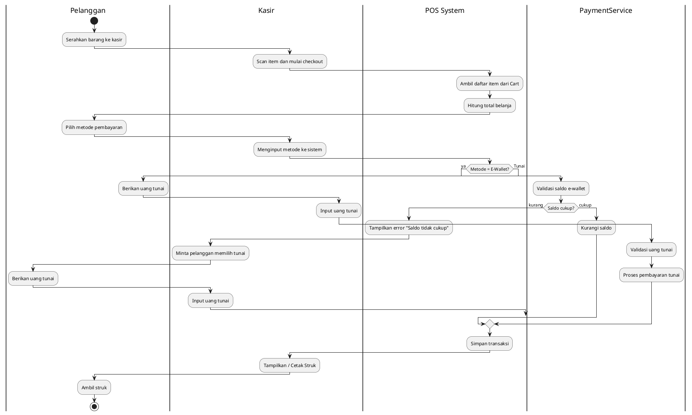

# Laporan Praktikum Minggu 1 (sesuaikan minggu ke berapa?)
Topik: [Tuliskan judul topik, misalnya "Class dan Object"]

## Identitas
- Nama  : M Khamdan A
- NIM   : 240202839
- Kelas : 3ikra

---

## Tujuan
Mahasiswa mampu mengidentifikasi kebutuhan sistem ke dalam diagram UML

Mahasiswa mampu menggambar UML Class Diagram dengan relasi antar class yang tepat

Mahasiswa mampu menjelaskan prinsip desain OOP (SOLID)

Mahasiswa mampu menerapkan minimal dua prinsip SOLID dalam kode program
---

## Dasar Teori
(Tuliskan ringkasan teori singkat (3–5 poin) yang mendasari praktikum.  
Contoh:  
1. Class adalah blueprint dari objek.  
2. Object adalah instansiasi dari class.  
3. Enkapsulasi digunakan untuk menyembunyikan data.)

---

## Langkah Praktikum
1. UML (Unified Modeling Language) adalah bahasa standar untuk memvisualisasikan, menspesifikasikan, membangun, dan mendokumentasikan artefak dari sistem perangkat lunak.

2. Use Case Diagram menggambarkan interaksi antara aktor (pengguna sistem) dengan fungsionalitas (use case) yang disediakan sistem.

3. Class Diagram menunjukkan struktur statis sistem dalam bentuk kelas, atribut, operasi, dan hubungan antar kelas.

4. Prinsip SOLID adalah lima prinsip desain yang bertujuan membuat perangkat lunak lebih mudah dipahami, fleksibel, dan dapat dipelihara.

5. Dependency Inversion Principle menyatakan bahwa modul tingkat tinggi tidak boleh bergantung pada modul tingkat rendah, tetapi keduanya harus bergantung pada abstraksi.

---

## Kode Program
(Tuliskan kode utama yang dibuat, contoh:  

)
---

## Hasil Eksekusi
(Sertakan screenshot hasil eksekusi program.  

)
---

## Analisis
(
- Jelaskan bagaimana kode berjalan.  
- Apa perbedaan pendekatan minggu ini dibanding minggu sebelumnya.  
- Kendala yang dihadapi dan cara mengatasinya.  
)
---

## Kesimpulan
(Tuliskan kesimpulan dari praktikum minggu ini.  
Contoh: *Dengan menggunakan class dan object, program menjadi lebih terstruktur dan mudah dikembangkan.*)

---

## Quiz
(1. [Tuliskan kembali pertanyaan 1 dari panduan]  
   **Jawaban:** …  

2. [Tuliskan kembali pertanyaan 2 dari panduan]  
   **Jawaban:** …  

3. [Tuliskan kembali pertanyaan 3 dari panduan]  
   **Jawaban:** …  )
